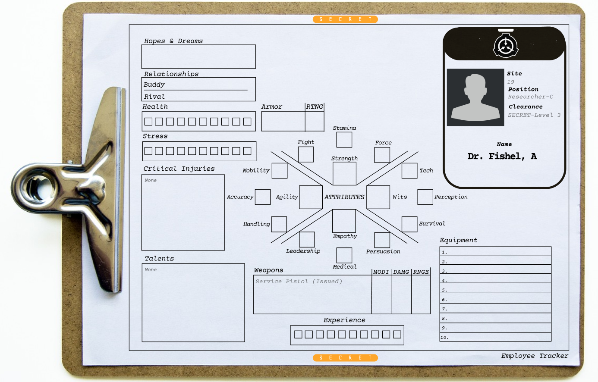

# Character Creation
---

As a player, you determine your PC's (Playable Character) thoughts, emotions, words, and actions – though not their outcomes. Your responsibility is to fully engage with your PC, they are essentially a person with emotions and aspirations, akin to yourself. Endeavor to envision how you would respond in their situation and what actions you would take. The player characters invariably take on the role of protagonists in the narrative, making the game revolve around you – your choices, your adventures. The goal of the game is to make a good story, allow your PC to grow and adapt to the risks and challenges they face.

The GM (Game Master) narrates the details of the game world, embodies the characters you encounter, and directs the adversaries you face. The gameplay unfolds as an ongoing dialogue between the PCs and the GM until a crucial situation arises, introducing uncertainty in the outcome. This is when dice come into play.

The GM's responsibility involves placing obstacles in your characters' path, challenging them, and compelling them to showcase their true abilities. However, it is not the GM's sole prerogative to dictate every event in the game, particularly the conclusion of your story. The unfolding narrative is collectively determined within the game. The essence of playing is dependent on discovering how your story will ultimately unfold.

6 Core Features of this TTRPG Engine

- Accessible
    - Easy to Learn and teach, Complexity is slowly added on!
- Fast & Decisive
    - Removes Dice rolls that don’t move the action forward!
    - Deadly combat, pushing conflicts to decisive moments!
- Risks & Rewards
    - PUSH a roll (reRoll) increases your odds, but at a cost!
- Player-Centric
    - PCs are the protagonists not the NPCs, your choice matters!
- Story-Driven
    - Collaborative Story Telling designed for Memorable fun!
- Adaptable
    - Differing styles, themes, game settings, and easily modifiable

## DICE POOLS

Pools of d6s to determine success, every “point” gets you a d6 to roll.

## STARTING STATS

**Starting HIST Scores**
History defines HIST ATRB

## Starting ATRB Scores
14 distributable points
- HIST ATRB (min 2 | max  5)
- Other Attributes (min 2 | max  4)

**Starting SKIL Scores**
10 distributable points
- HIST ATRB SKILs (min 1 | max 3)
- Other SKILs (min 0 | max 1)

**Starting TLNT Scores**
1 TLNT based on HISTory

##### HEALTH = HP (Physical Health Points)
HLTH = STRG + AGIL +1 
- STRG - Raw muscle, Health
- AGIL - Body Control, speed and motor skills

#### Encumberance or Max Inventory
STRG x2

##### RESOLVE = MP (Mental Health Points)
RSLV = WITS + EMPA +1
- WITS - Sensory perception, Intellect, Sanity
- EMPA - Charisma, Feelings, Insight

## LEVELING UP
EXPR can be spent during PC Rests
ATRB Scores Cannot change

### Leveling SKIL Scores
SKIL must have succeeded once on this level before spending EXPR
- LEVL-1 = EXPR-5
- LEVL-2 = EXPR-10
- LEVL-3 = EXPR-15
- LEVL-4 = EXPR-20
- LEVL-5 = EXPR-25

### Learning new TLNTs
TLNTs must be taught by a PC or NPC who already knows the TLNT
Teacher must instruct you for 1 SHFT
After Instruction, Teacher must succeed a PERS roll! otherwise, instruct again
- Every TLNT Cost  EXPR-10

# CHAR HISTORIES
What is your purpose for being here?
- Are you here for **Personal** Reasons?
- Are you **Employed** by the SCP Foundation?
- Are you **Contracted** to perform a service here?
---
### Your history offers primary loadout, but you will change as time goes on, we all do.

|Purpose |History | Identification | Description | Gear| Talent
|-|-|-|-|-|-|
Personal| WITS |Private Investigator |You’ve spent years searching for answers. But this is it, you know they’re here.| <li>  Leather Jacket (1 ARMR) <li> Old Photograph <li> Service Pistol (d6)|RECK
Personal| EMPA| Pedestrian | You're not quite sure how you ended up here. You saw a building in the middle of the city you've never noticed before, and now you're inside. | <li> Backpack (+2 INVT) <li> Raincoat <li> Walking Stick (d6)|LCKY
Personal| EMPA|Writer | That manuscript was your ticket back on the bestseller list, but it was confiscated by the BUREAU before you could make a second copy. | <li> Heavy Flashlight <li> Snub Revolver (d6)<li> Thermos|INQU
Personal| WITS|Incident Survivor | The Bureau tried to sweep it all under the rug, but you were THERE, and you know what you saw. THey have to tell you the Truth. | <li>Hunting Rifle (D8, Bulky) <li> Reflective Vest|TUGH
Personal| WITS|Investigative Journalist | This is the big one, your pulitzer potential magnum opus. In the war to uncover the TRUTH, the next battle is in this building. | <li> Mini Shotgun Mic <li> LED Light<li> Smartphone Tripod | VIBE
Personal| WITS| Ghost Hunter | Ever since your show was cancelled, you've been trying to go legit. They haven't returned your calls, but there's no harm in showing up in person. |<li> Spirit Box <li> Thermal Camera <li> EVP Wrist recorder| MIND
Personal|AGIL| Skater | You have to admit, the rumors about this place are pretty freaky. Unfortunately, you need to take a piss, and you won't chicken out of the dare.| <li> Skateboard (d6) <li> Camcorder|RFLX
Personal| AGIL|Activist | Artifacts should be used for the benefit of mankind, and yet, the BUREAU just sequesters them away. It's time to give power back to the people. |<li> Decoy Face Mask <li> Spray Paint <li> Pistol (d6)|KILR
Personal| EMPA|Lunch Buddy | Every weekday for the last two years you've met at exactly 11:30am at the corner cafe. Two days have passed with no word. | <li> Takeout for Two <li> Handwritten note <li> Flowers|PASN
Employee| EMPA|Unionizer | Public employees have a right to fair representation, but efforts to organize here have been DOA. Maybe they just don't know their rights. | <li> Box of Donuts <li> "Know your rights" Pamphlets <li> A stack of Business Cards|MULE
Employee|EMPA| Medic | Bureau field work is dangerous, but you're there to stitch the agents back up. A quick stop back at the office to resupply, then it's back on assignment. | <li>Medkit <li> stethoscope <li> Trauma Shears (d6) <li> gloves|DOCT
Employee| STRG|Sleeper Agent | Your boring normal life changed when the phone rang. You don't quite remember what was said, just that everything has been different since.|<li> Palm Pistol (d6) <li> Garrote (d8,brutal) <li> Cyanide Pill|MERC
Employee|STRG| Agent | You specialize in "Asset Recovery" for the COMPANY. The MONOLITH was a hard nut to crack, but you have an in. Leave no trace of your deeds. | <li> Compact Toolkit<li> Handheld PC<li> False Bureau ID|QUIK
Employee| AGIL| Unpaid Intern | After a grueling interview process, you've been offered the opportunity of a lifetime. Today is your first day, please report to the HEAD OF RESEARCH for orientation | <li> Caffeine Patch (Recover 3 DEX)<li>Laptop <li> messenger bag|SCND
Employee|STRG| Promotable| After months of work, the astral terrorists are behind bars. For your hard work, you've finally been offereed that cushy office job. All that's left is to lock the RESONANT ARTIFACT in THE GALLERY |<li> Service Pistol (d6) <li> Resonant Artifact|WEPS
Employee|AGIL| Interim | This place needs to have long term potential. You're tired of being new. If you go above and beyond this time, maybe you'll finally get to use that Engineering Degree. | <li> Custom Name Plate (d6) <li> Lunchbox <li>Resume|HRDN
Contracted|WITS| Auditor | Records show that BUREAU has missed the last 51 annual safety inspections. This oversight simply CANNOT stand. | <li>Inspection Form <li>Flashlight (d6) <li> All-in-one Measurement/Testing Tool|GRIT
Contracted|AGIL| Process Server | You're about to hit your 100th subpoena served! All you need to do is find HEAD ARCHIVIST SIMS and deliever their papers to get your award. | <li> Court Documents <li> Taser (d6,targets Dex) <li> Disguise|DEXT
Contracted| EMPA|Team Builder | You're all ready to deliver the first of four professional development sessions on "Implementing Synergy to Optimize Work Flow" | <li> Laser Pointer <li> Laptop with PowerPoint up <li> Hardshell case full of Handouts (d6)|HTTR
Contracted|AGIL| Mail Worker | The delivery address lacks a formal name, but management was adamant you collect a signature for this package |<li> Unusually heavy package (BULK) <li> Fold-up Dolly <li> Electronic Signature iPad| BARD
Contracted|STRG| IRS - Taxman| The Roadblocks have been infuriating, but you've at least managed to track the budget discrepancy to this building.| <li> Briefcase <li> tailored suit|MEAN
Contracted|STRG| Rival Agency | You work for the other agency. Rumors have reached your ear of trouble at the BUREAU. Usually it's none of your business, but with that federal budget meeting coming up... | <li> Kevlar Vest (1 ARMR) <li> Assault Riffle (D8, d6 Blast, BULK)| SNPR
Contracted| STRG| Construction| This work order has been passed around the firm all month. You should be able to wrap up with enough time to read your book. | <li> Flashlight <li> Tool Belt (BULK) <li> Faded Paperback| HLER
---
# ATRB (Attributes)
---

### ATRB Lanes
Name | Lane | Breakdown
|-|-|-|
Physical | Health | Strength, Agility
Mental | Resolve | Wits, Empathy

### ATRB Core
|ATRB | Name | DESC
|-|-|-|
STRG | Strength | Force, Fight, Stamina
AGIL | Agility | Accuracy, Mobility, Sneak
WITS | Wits | Technology, Observation, Survival
EMPA | Empathy | Medic, Insight, Persuasion

### ATRB Skills
|ATRB |SKIL |Name| DESC
|-|-|-|-|
STRG|FRCE | Force | lift, push, break. Feats of Strength|
STRG|FGHT | Fight | melee, hand-to-hand, close quarter combat, defenses |
STRG|STAM | Stamina | Physical endurance, breathing, resistances|
AGIL|MOBL | Mobility | Movement, speed, motor control, Feats of Agility|
AGIL|ACCR | Accuracy | Ranged weapons or throwing items|
AGIL|SNEK | Sneak | Blending in, hiding, pickpocket, counter OBSV |
WITS|TECH | Technology | Crafting, repairing broken items, Building |
WITS|OBSV | Observation | Perception, Analysis, Feats of Wit, counter SNEK|
WITS|SURV | Survival | Weather, Nature, External Resistances, Travel knowledge |
EMPA|MEDC | Medic | Healing, First-Aid, Home Remedies |
EMPA|FEEL | Feelings | Insight, Lie detection, Emotional Intelligence, Feats of Empathy|
EMPA|TALK | Talking | Charm, Spinning the truth, Convincing others |

## EXPR = Experience questions
You will receive XP after the end of each game session. Talk through the following questions and if you successfully can answer "Yes" to a question you will get a point. These **EXPR** points can be spent to upgrade **ATRB**s Attributes or **TLNT**s Talents

Experience Badges Per Character per Game session
Some of these are just flavor or **ROLE** which need to be roleplayed out to gain the desired **OPGS** (Once Per Game Session) effect.

Badge | Name | Description 
-|-|-|
PRID | Standout Proud of ROLE| AutoWin SKIL check with ROLE
WEAK | Weakness ROLE| If it makes Trouble, get EXPR
SCRT| Past Secret Stories ROLE |If it Haunts you, get EXPR
GOAL |Big Dream ROLE |If you work towards it, get EXPR
HERE| Participation| Showing up is half the battle! get EXPR
EXPL|Explorer| Did you explore a new location? Get EXPR
CMBT| Combat | Did you fight and defeat an Adversary? Get EXPR
CRTV| Creative | Did you overcome an obstacle creatively? get EXPR
BUDD | 1 favorite PC you like |If you help them, get EXPR
RIVL | 1 different PC you dislike |If you hurt them, get EXPR

## TLNT Talents
While Attributes and skills outline your general capabilities, talents delineate particular areas of expertise. Talents **TLNT** embody distinctive tricks and specialties, providing you with a competitive advantage and introducing an element of unpredictability for your adversaries. Initially, you typically begin the game with one or a few **TLNT**s, and your options are constrained by your **HSTR** History. However, you can acquire additional specialties during the game without being restricted by your archetype.

TLNT | Talent | Description
|-|-|-|
GARD| BodyGuard|If someone within Short range of you is hit by an attack, you can dive in to take the hit. Roll for Mobility. It doesn’t count as an action in combat. If you roll one or more successes, you take the hit instead of your friend. You can push the roll.
PASS| Compassion| You can push any skill roll based on Empathy twice, not just once like other characters.
RFLX| Fast Reflexes| You can draw two initiative cards instead of one during the initiative draw. Choose the one you want to use.
DOCT| Field Surgeon| You know the delicate art of stopping a wound from bleeding or treating grave injuries. You get a +1 modifier to Healing when treating someone who is about to die from a critical injury.
DEXT| Flywight| When you block in close combat, you can use Agility instead of Strength.
VIBE| Gut Feeling| You have a knack for sensing when trouble is coming your way. You can roll for Observation using Empathy instead of Wits to detect an approaching threat.
HRDN| Hardened| Your maximum Resolve score is increased by 1. You can take this specialty up to three times.
HTTR| Hard Hitter |You get a +1 modification to Melee Combat if you sacrifice your fast action in the round.
HLER| Healer| You are very resilient and recover quickly from injuries. The healing time of critical injuries is halved for you.
INQU| Inquisitive| You can push any skill roll based on Wits twice, not just once like other characters.
KILR| Killer| You know where to strike to make your enemy fall and not get up. Ever. When your enemy sustains a critical injury you may roll twice and choose the result you want.
LCKY| Lucky| No matter what horrible situations you end up in, you always seem to make it out unscathed. When you suffer a critical injury, you get to re-roll the dice and choose the result that you prefer.
MEAN| Meanicing| You have a scary physical presence that makes it easy to intimidate people. You can roll for Persuasion using Strength instead of Empathy when you threaten someone.
MERC| Merciless| You can perform a coup de grace without rolling for Empathy.
BARD| Musician| You get a +1 modifier to all Persuasion rolls in situations where singing or playing an instrument is helpful.
MULE| Pack Mule| Your carry limit is increased by +2.
QUIK| Quick Draw| You can draw your weapon so quickly it doesn’t cost you an action.
RECK| Reckless| You can push any skill roll based on Agility twice, not just once like other characters.
SCND| Second Wind| When you are broken, you can get back on your feet immediately. Roll for Stamina. You cannot push the roll. For every success you roll, you get one point of Health or Resolve back (or attribute point, if using attribute damage). You can only use this specialty once while broken, and it has no effect against critical injuries.
SNPR| Sniper| You get a +1 modifier to Marksmanship rolls when firing a single shot (not full auto) at Long range or more, from a hidden position.
TUGH| Tough| Your maximum Health score is increased by 1. You can take this specialty up to three times.
GRIT| True Grit| You can push any skill roll based on Strength twice, not just once like other characters.
WEPS| Weapon Specalist| You’re an expert at using a certain type of weapon. When you use this type of weapon, you get a +1 modifier. You can choose this specialty several times, once for each weapon type. You can be a specialist at fighting unarmed.
NATR| Nature Magic| MAGIC SPELLS are covered on another page
WATR| Water Magic|  MAGIC SPELLS are covered on another page
FIRE| Fire Magic|  MAGIC SPELLS are covered on another page
WIND| Air Magic|  MAGIC SPELLS are covered on another page
ERTH| Earth Magic|  MAGIC SPELLS are covered on another page
DIVN| Divine Magic|  MAGIC SPELLS are covered on another page
MIND| Mind Magic|  MAGIC SPELLS are covered on another page

## ATRB RTNG

RTNG | DESC | Description
|-|-|-|
1| Feeble           |Novice
2| Below Average    |Trained
3| Average          |Experienced
4| Capable          |Veteran
5| Extraordinary    |Elite

## STNT (Stunts)
Stunts are the next level of success
|STNT|Stunts|Description|
|-|-|-|
|S-OHIC|Ohhhhh I See!| EASE for this ATRB
|S-GOTU|I Got You!| EASE for CHAR on this same C-Check!
|S-THIS|I Got this!| AutoWin on this same C-Check!
|S-EZPZ|Too Easy!|You finish in Half the time!
|S-GETU|Get Over Here!| Grapple => D-STRG
|S-SMOO|Smooth!|You act completely quietly!
|S-SHOW|Show Off!|  You Show off impressing someone!
|S-CMBO|Wombo Combo!| One more Point of DMG (can be multiplied by WINs)
|S-TRYM|Try Me!|OutManeuver your opponent, Switching INIT with them
|S-NOPE|NOPE!| You knock an item away from your opponent => O-Drop
|S-YDON|You're Done!|You pin your oponent down, they enter "Panic", Only humanoids
|S-STAY|Stay Down!| Your Opponent falls prone, Only humanoids
|S-DNCE|Let's Dance! | You can ReRoll Initiative!
|S-TELL|True Story!|  Ask the GM a question, get a legit answer
|S-HIDE|Wasn't Me!| You hide your tracks
